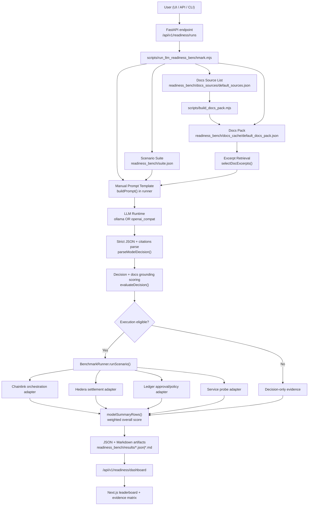

# Architecture: x402Bench LLM Readiness

## System Diagram

## Source Of Truth Map

| Concern | Source | Type |
| --- | --- | --- |
| Scenario definitions, expected labels, required docs per case | `readiness_bench/suite.json` | Manual benchmark design |
| Official docs URL list (user-editable) | `readiness_bench/docs_sources/default_sources.json` | Manual curation |
| Cached docs content chunks | `readiness_bench/docs_cache/default_docs_pack.json` | Generated artifact |
| Docs fetching/chunking logic | `scripts/build_docs_pack.mjs` | Programmatic pipeline |
| Prompt template + strict schema | `buildPrompt()` in `scripts/run_llm_readiness_benchmark.mjs` | Manual prompt logic |
| Docs retrieval per case | `selectDocExcerpts()` in `scripts/run_llm_readiness_benchmark.mjs` | Programmatic retrieval |
| LLM runtime choice | API payload / CLI args (`runtime`, `models`) | User choice |
| Score weights | `modelSummaryRows()` in `scripts/run_llm_readiness_benchmark.mjs` | Manual weighting design |
| Real workflow execution path | `src/core/runner.js` + adapters in `src/adapters/*` | Programmatic execution |

## Manual Prompting vs Documentation Grounding

- The benchmark **does use manual prompts** (fixed JSON schema + policy instructions) to keep output format stable and scoreable.
- The benchmark is also **documentation-grounded**:
  - docs are fetched from official URLs into a docs pack,
  - excerpts are selected per case,
  - model output must cite excerpt IDs (`source_id#chunk_index`),
  - citation validity and required-source coverage affect score and execution eligibility.

This hybrid is intentional: deterministic scoring + real documentation-following pressure.

## Weighting (Where It Comes From)

Weights are hard-coded in `modelSummaryRows()`:

- Docs-enabled runs:
  - Base policy 21%
  - Controls F1 18%
  - Parse rate 10%
  - Full match 10%
  - Workflow success 11%
  - Docs grounding 12%
  - Required source coverage 9%
  - Citation validity 5%
  - Latency score 4%

- Docs-disabled runs:
  - Base policy 28%
  - Controls F1 24%
  - Parse rate 14%
  - Full match 14%
  - Workflow success 15%
  - Latency score 5%

## Runtime / Tooling Model

- Uses LLM runtimes:
  - `ollama` (local models)
  - `openai_compat` (HF Router/OpenRouter/OpenAI-compatible APIs)
- Uses benchmark adapters and workflow tools in code.
- Does **not** use MCP-based agent tool calling in the benchmark loop.

## Reliability Controls

- Run serialization with condition locks (prevents overlapping readiness runs).
- Idempotency cache support (`Idempotency-Key`) for duplicate-safe retries.
- Bounded timeouts for subprocess benchmark execution.
- Machine-readable + human-readable artifacts for auditing and judging.
