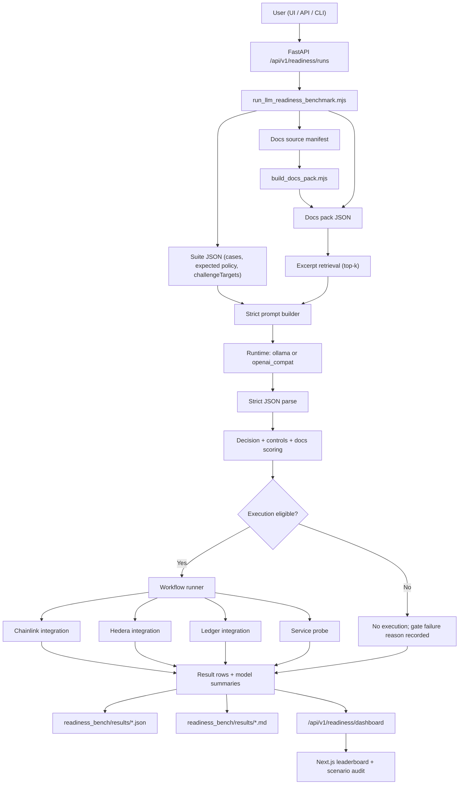

# Architecture: x402Bench LLM Readiness

## System diagram

## Source-of-truth map

| Concern | Source |
| --- | --- |
| Cases, expected labels, required sources, sponsor challenge targets | `readiness_bench/suite.json` |
| Official docs source list | `readiness_bench/docs_sources/default_sources.json` |
| Cached docs chunks | `readiness_bench/docs_cache/default_docs_pack.json` |
| Docs fetch/chunk pipeline | `scripts/build_docs_pack.mjs` |
| Prompt + parse schema | `scripts/run_llm_readiness_benchmark.mjs` |
| Retrieval per case | `selectDocExcerpts()` in runner |
| Case scoring and execution gate | `evaluateDecision()` in runner |
| Aggregate score weighting | `modelSummaryRows()` in runner |
| Workflow execution | `src/core/runner.js` + `src/adapters/*` |
| Dashboard payload shaping | `backend/app/main.py` |
| UI rendering and explanations | `frontend/app/page.tsx` |

## Prompting and docs-grounding

The benchmark intentionally uses a hybrid design:
- fixed structured prompt + strict JSON output for deterministic scoring
- case-level docs excerpts from official sources for grounding pressure

This is deliberate: stable scoring plus realistic documentation-following behavior.

## Gate semantics

Execution gate is policy-driven and does not require docs pass.

Execution is allowed only when all are true:
- case `executionMode` is `real`
- expected case policy is `allow`
- parse success
- decision match
- approval match
- priority match
- risk match
- controls F1 >= 60

Docs metrics (`docsGrounded`, source coverage, citation validity):
- contribute to quality score and strict-match metrics
- do not directly block execution

## Runtime model

Supported runtime modes:
- `ollama` (local models)
- `openai_compat` (HF Router/OpenRouter/OpenAI-compatible APIs)

The benchmark does not depend on MCP tool-calling. It benchmarks structured policy reasoning and workflow readiness through deterministic adapters and endpoints.

## Reliability controls

- run serialization lock for readiness runs
- idempotency key cache for duplicate-safe API triggers
- bounded subprocess timeout for benchmark execution
- JSON + Markdown artifacts for reproducible audits

## Sponsor-track mapping model

Each case may declare explicit `challengeTargets` (sponsor + challenge name) and `representativeRationale`.

The UI uses this metadata for:
- sponsor score grouping
- scenario audit explanation
- challenge representativeness transparency
